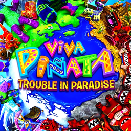
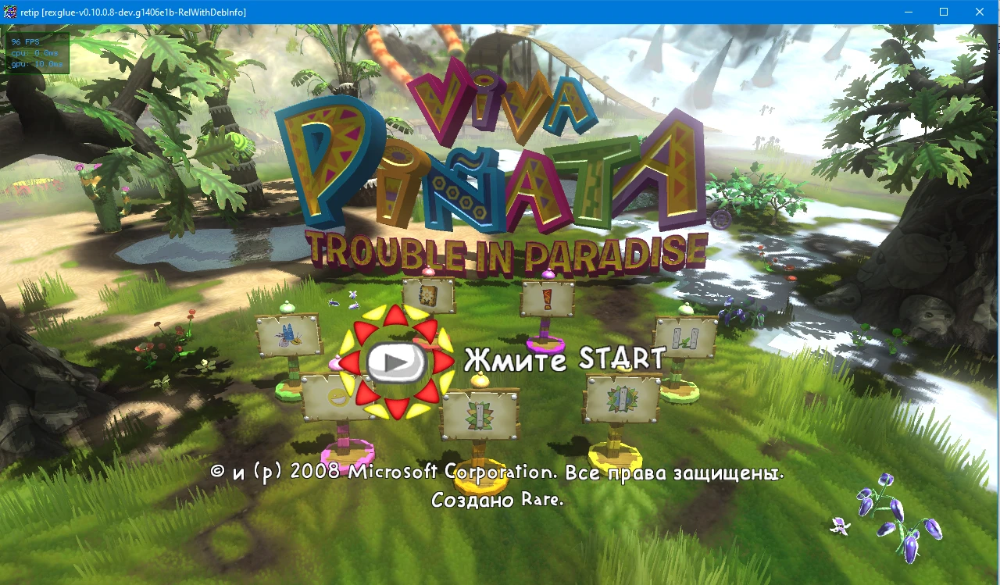
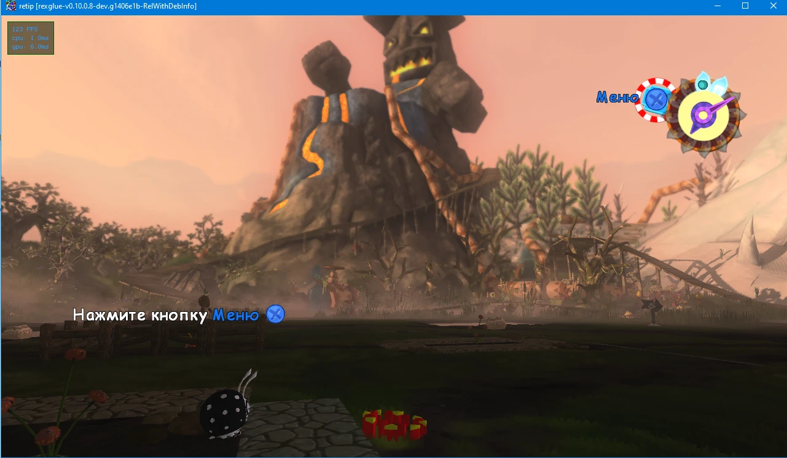

<div align="center">



# Viva Piñata: Trouble in Paradise Recomp

**Viva Piñata: Trouble in Paradise (Xbox 360, 2008) running natively on Windows PC**

**English** · [Русский](README.ru.md)

[](#what-you-need)
[](#which-game-version-you-need)
[](https://github.com/rexglue/rexglue-sdk)
[](#settings)
[](#what-works)
[](#russian-language)

 

</div>

---

## What is this?

The original Xbox 360 game, converted into a normal Windows program. It is **not an emulator**: the game's code was translated to C++ with [ReXGlue SDK](https://github.com/rexglue/rexglue-sdk) ("static recompilation").

It is [SolarCookies/TiP-Recomp](https://github.com/SolarCookies/TiP-Recomp) (ReTiP: the launcher, mouse controls, the in-game tools menu and the mods) moved to ReXGlue SDK 0.10, with a Russian translation added.

> [!IMPORTANT]
> **No game files are included.** You need your own copy of the game, and it must be the version below.

## What you need

- A Windows 10 or 11 PC (64-bit) with a DirectX 12 graphics card.
- About **25 GB** of free disk space (Visual Studio ~12 GB, the game ~5 GB, the disc image ~8 GB while unpacking).
- Your own disc image (`.iso`) of **Viva Piñata: Trouble in Paradise** for Xbox 360.

## Which game version you need

| | |
| :-- | :-- |
| **Disc (Redump name)** | `Viva Pinata - Trouble in Paradise (World)` |
| **Title ID / Media ID** | `4D53085F` / `76A44A5D` |
| **Version** | `0.0.0.4`, the original disc, no title update needed |
| **ISO checksum** | MD5 `aad50e5418e22e8a9b92d2c0c258079e`, CRC32 `04843ff9` |
| **`default.xex` SHA-1** | `c5970941fcb201dda99de0d35b623827241d6b8b` |

Other editions have not been tested. *Viva Piñata* (2006) and *Viva Piñata: Party Animals* are different games; for the first one see [Viva Piñata Recomp](https://github.com/crabinacrabic/VivaPinataRecomp).

## The easy way: let an AI agent install it

1. Install an AI assistant that can run commands on your computer, for example [Claude Code](https://claude.com/claude-code), OpenAI Codex or Cursor.
2. Paste this message into it, with the real path to your ISO:

   > Install Viva Piñata: Trouble in Paradise Recomp on this PC: https://github.com/crabinacrabic/VivaPinataTroubleInParadiseRecomp — follow AGENTS.md from that repository. My game disc image is at `C:\path\to\Viva Pinata - Trouble in Paradise (World).iso`.

3. The agent downloads and checks everything. When it asks, click through the Visual Studio installer and press **Build** in Visual Studio.
4. When it is done, start `out\build\local-win-relwithdebinfo\retip.exe`.

## Doing it yourself (6 steps)

1. **Install the tools.** You need:
   - [Visual Studio 2026 Community](https://visualstudio.microsoft.com/) (free), with the workload **Desktop development with C++** and the component **C++ Clang tools for Windows**;
   - [Git](https://git-scm.com/).
2. **Download the project.** Use a folder path that contains only English letters, then run:
   ```bash
   git clone https://github.com/crabinacrabic/VivaPinataTroubleInParadiseRecomp.git C:\Games\VivaPinataTiPRecomp
   ```
3. **Unpack the game** with [extract-xiso](https://github.com/XboxDev/extract-xiso/releases/latest) (file `extract-xiso-Win64_Release.zip`):
   ```bash
   extract-xiso -x -d C:\Games\VivaPinataTiPRecomp\assets "C:\path\to\Viva Pinata - Trouble in Paradise (World).iso"
   ```
   Afterwards `assets` must contain `default.xex` and a `Beta` folder.
4. **Build it.**
   - In Visual Studio: **File → Open → Folder…** → select `C:\Games\VivaPinataTiPRecomp`.
   - Wait until the Output window says the CMake generation has finished. The first time takes a few minutes: it downloads the SDK and converts the game code.
   - In the toolbar, choose the configuration **`local-win-relwithdebinfo`** (not `local-win-debug`, see [below](#if-something-goes-wrong)).
   - Click **Build → Build All** (`F7`).
5. **Start it:** `Ctrl+F5` in Visual Studio, or double-click `out\build\local-win-relwithdebinfo\retip.exe`. The game starts in a window.
6. **In the launcher** press **PLAY** (or `Enter`).
   - **OPTIONS** has the aspect ratio (16:9 to 32:9 or custom), resolution (720p / 1440p), graphics quality, fullscreen, the FPS counter and limit, skipping the intro videos, and the game text language.
   - The button in the top-right corner switches between fullscreen and a window. Untick **Show this launcher on startup** to go straight into the game.

## Russian language

The Xbox disc has no Russian, and there was no translation of this game, so it was made for this project:
- about 4 400 lines and the names (piñatas, characters, places) come from the **ZoG Team** translation of the first game's PC version ([zoneofgames.ru](https://www.zoneofgames.ru/));
- the other 4 600 lines were translated with Google Gemini, using the same names;
- [`tools/tip_text.py`](tools/tip_text.py) checks all 9 019 lines: markup, button icons, names inserted by the game, and that the text fits the game's text blocks.

The translation files are not stored here, because they contain the game's text. With them in `translation/work/`, run:

```bash
python tools/tip_text.py build
```

It writes `assets/Beta/bundles/russian.bnl` in a few seconds. Then choose **OPTIONS → Language → Game text → Russian** in the launcher. Choosing English puts the original file back.

## Controls

The game is made for an Xbox controller, which works right away. The mouse and keyboard can also be used:

| Mouse / keyboard | Controller | | Mouse / keyboard | Controller |
| :-- | :-- | :-- | :-- | :-- |
| Move the mouse | turn the camera | | `E` | **RB** |
| Mouse wheel | zoom | | `Numpad +` / `Numpad −` | **LT** / **RT** |
| Left button | **A** | | `1` `2` `3` `Q` | D-pad up / right / left / down |
| Right button | **B** | | `Shift` / `M` | **L3** / **R3** |
| Middle button, `Enter` | **X** | | `C` | slow movement |
| Mouse button 5, `I` | **Y** | | `Esc`, mouse button 4 | **Back** |

All keys can be changed in `retip.toml` next to `retip.exe` (`keybind_*`).

Extra keys of this project:
- hold **Back** on the controller for half a second: the ReTiP tools menu (spawn piñatas and plants, player, graphics, upscaling, settings);
- `Shift+Esc` or `End`: quit the game (asks first).

## Settings

Most settings are in the launcher. Everything else is in `retip.toml` next to `retip.exe` (created from [`packaged/retip.toml`](packaged/retip.toml) on the first build).

The mods from [`packaged/mods`](packaged/mods) are listed there too. With ReXGlue SDK 0.10 only data mods work (PureTagColors); the texture and shader mods (WaterFix, DitherFix, IceShader, BorderlessTag, CustomProfileTag) needed the GPU layer of the original SDK fork and are inactive for now.

## What works

| | |
| :-- | :-- |
| ✅ | Title screen, menus and the garden |
| ✅ | Sound, Xbox controller, mouse and keyboard |
| ✅ | Launcher with display and quality options, ReTiP tools menu |
| ✅ | Russian text |
| 🚧 | Texture and shader mods are inactive (data mods work) |
| 🚧 | Direct3D 12 only |
| 🚧 | The Xbox Live Vision camera and online play are not supported |

## If something goes wrong

| Problem | What to do |
| :-- | :-- |
| The launcher says "Game files not found", **PLAY** is grey | Check that `assets\default.xex` and `assets\Beta` exist |
| The game closes a few seconds after **PLAY** when built as `local-win-debug` | A bug in the SDK's debug runtime (its UI drawer uses an invalidated iterator when it frees a texture). Use `local-win-relwithdebinfo` |
| Visual Studio stops at "Access violation" when started with `F5` | This is not a crash. Turn off breaking on `0xC0000005` (Debug → Windows → Exception Settings), or start with `Ctrl+F5` |
| Build error `Microsoft Visual C/C++ Version differs in precompiled file` | Visual Studio was updated. Delete `out\build\local-win-relwithdebinfo` and build again |
| Code generation fails with `0xC0000409` | The project path contains non-English characters. Move the project, for example to `C:\Games\VivaPinataTiPRecomp` |

Logs are written to `out\build\local-win-relwithdebinfo\logs\`.

## For developers

- [`docs/PORTING_0.10.md`](docs/PORTING_0.10.md): what changed when moving from the original SDK fork to ReXGlue SDK 0.10.
- [`tools/tip_text.py`](tools/tip_text.py): `extract`, `check` and `build` for the game text. The text bundle is a Rare CAFF file: every block keeps its size and the text stream keeps its exact compressed size, because the game decompresses it in place.
- [`translation/GEMINI_BRIEF.md`](translation/GEMINI_BRIEF.md): the brief the translation was made with.

## Credits

- [SolarCookies/TiP-Recomp](https://github.com/SolarCookies/TiP-Recomp): the original project (ReTiP)
- [ReXGlue SDK](https://github.com/rexglue/rexglue-sdk): recompiler and runtime
- [Xenia](https://github.com/xenia-project/xenia) and [Xenia Canary](https://github.com/xenia-canary/xenia-canary): graphics backend
- ZoG Team ([Zone of Games](https://www.zoneofgames.ru/)): the Russian translation of the first game, the base for the names and many lines
- Rare: for a wonderful game

## Legal

This project is not affiliated with or endorsed by Microsoft or Rare. It contains no game files; you need your own legally obtained copy. Viva Piñata is a trademark of Microsoft Corporation. The original TiP-Recomp does not declare a license, so its code stays under its author's copyright.
